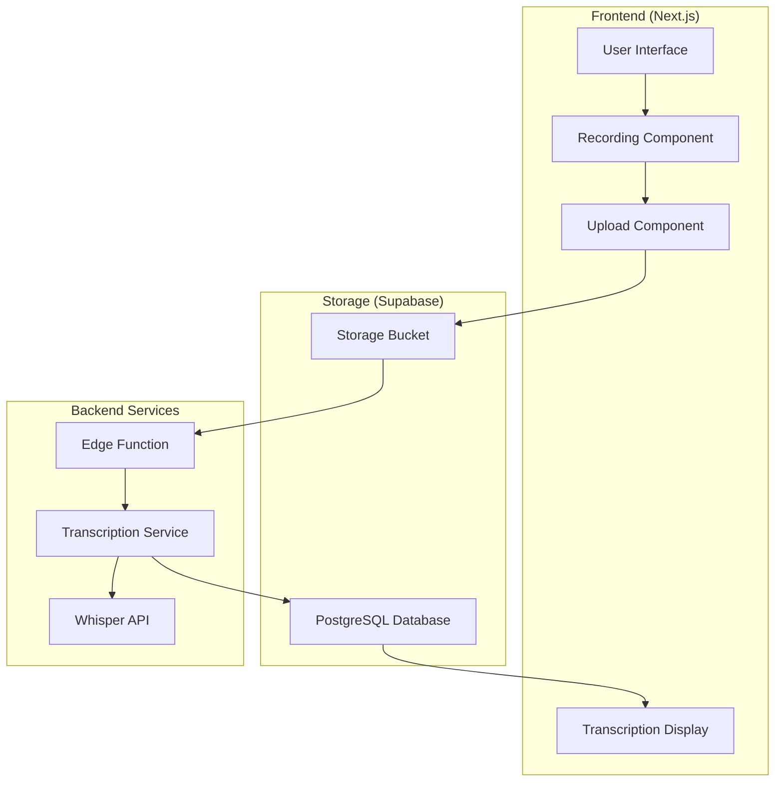
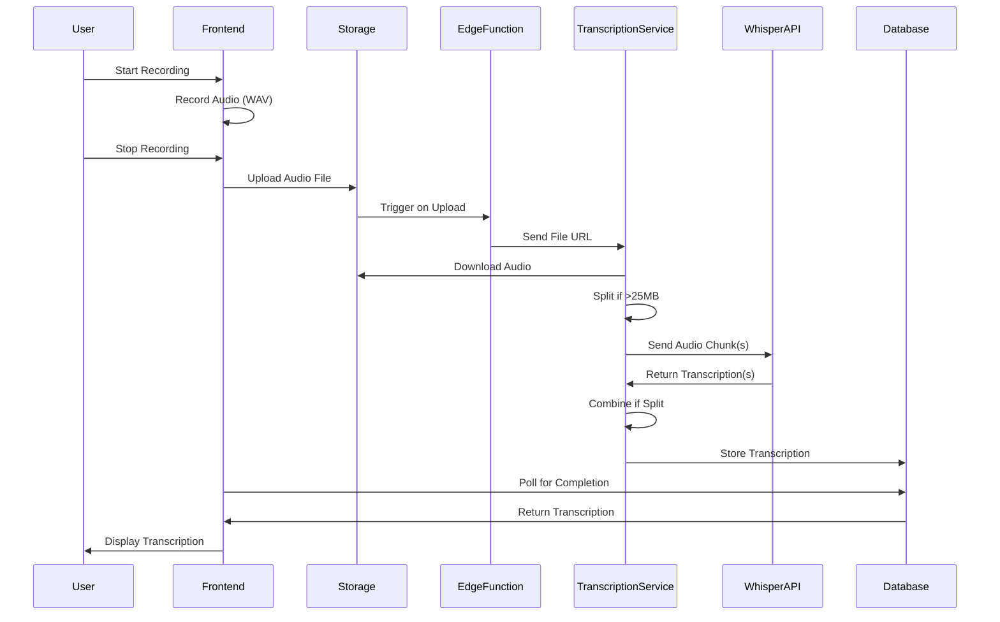

# System Patterns: Medical Note Transcription App

## System Architecture

The Medical Note Transcription App follows a modern, distributed architecture with clear separation of concerns:

## Component Relationships

### Frontend Components

1. **User Interface (UI)**
   - Container for all frontend components
   - Manages application state and routing
   - Implements responsive design for desktop and mobile

2. **Recording Component (RC)**
   - Handles audio recording using Recorder.js
   - Captures 16-bit PCM/WAV format audio
   - Provides recording controls and timer display

3. **Upload Component (UC)**
   - Manages file upload to Supabase Storage
   - Displays upload progress
   - Handles upload errors and retries

4. **Transcription Display (TD)**
   - Retrieves transcription from PostgreSQL
   - Displays transcription text with appropriate formatting
   - Shows transcription status (processing, completed)

### Backend Components

1. **Storage Bucket (SB)**
   - Stores WAV audio files
   - Triggers events on file upload

2. **PostgreSQL Database (PG)**
   - Stores transcription metadata and text
   - Maintains relationship between audio files and transcriptions

3. **Edge Function (EF)**
   - Triggered by storage events
   - Calls transcription service with file URL

4. **Transcription Service (TS)**
   - Python FastAPI microservice
   - Handles audio file processing
   - Manages communication with Whisper API
   - Stores transcription results in PostgreSQL

5. **Whisper API (WA)**
   - OpenAI's API for audio transcription
   - Processes audio chunks and returns text

## Data Flow Patterns

### Recording and Transcription Flow

## Key Technical Decisions

1. **High-Quality Audio Format**
   - Decision: Use 16-bit PCM/WAV format for audio recording
   - Rationale: Highest quality available in browsers, leading to better transcription accuracy
   - Implementation: Recorder.js library configured for WAV output

2. **Backend Transcription Processing**
   - Decision: Process transcriptions entirely on the backend
   - Rationale: Removes computational burden from client devices, handles longer recordings
   - Implementation: FastAPI microservice with OpenAI Whisper API integration

3. **Audio File Splitting**
   - Decision: Split audio files exceeding 25MB into chunks
   - Rationale: Whisper API has a 25MB file size limit
   - Implementation: Python pydub library for audio processing

4. **Serverless Architecture**
   - Decision: Use serverless components where possible
   - Rationale: Improved scalability, reduced operational overhead
   - Implementation: Next.js on Vercel, Supabase Edge Functions

5. **Separate Transcription Service**
   - Decision: Deploy transcription service separately from frontend
   - Rationale: Allows for longer processing times and specialized scaling
   - Implementation: FastAPI on Heroku or similar platform

## Design Patterns

1. **Event-Driven Architecture**
   - Storage events trigger transcription process
   - Asynchronous processing decouples recording from transcription

2. **Microservice Pattern**
   - Separate services for frontend and transcription
   - Clear API boundaries between components

3. **Polling Pattern**
   - Frontend polls database for transcription status
   - Simple implementation for MVP (could be replaced with WebSockets/Realtime in future)

4. **Repository Pattern**
   - Abstraction layer for database operations
   - Centralizes data access logic

5. **State Management**
   - Frontend maintains application state (recording, uploading, transcribing)
   - Clear state transitions with appropriate UI feedback

## Technical Constraints

1. **Browser Audio Limitations**
   - Constraint: Browsers limit audio recording quality and format options
   - Mitigation: Use Recorder.js for highest quality available (16-bit PCM/WAV)

2. **File Size Limits**
   - Constraint: Whisper API has a 25MB file size limit
   - Mitigation: Split audio files into chunks and combine transcriptions

3. **Mobile Browser Compatibility**
   - Constraint: Safari on iOS has specific requirements for audio recording
   - Mitigation: Test thoroughly on iOS devices, implement appropriate permissions handling

4. **Processing Time**
   - Constraint: Transcription of long audio files takes time
   - Mitigation: Clear status indicators, asynchronous processing
