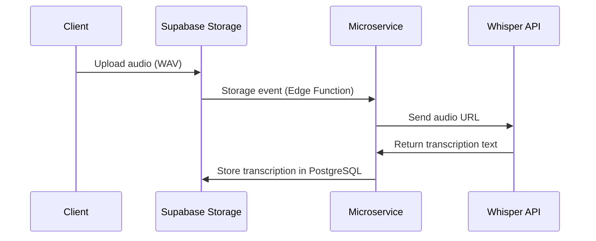

Below is the Product Requirement Document (PRD) for the Medical Note Transcription App (MVP) in markdown format.

---

# Product Requirement Document: Medical Note Transcription App (MVP)

## 1. Product Overview

This full-stack web application allows doctors to record and transcribe medical notes efficiently. The app records audio in the highest-quality format available in the browser and processes transcriptions entirely on the backend. Designed as an MVP, it focuses on core functionality—recording, uploading, transcribing, and displaying transcriptions—without implementing security or authentication at this stage.

## 2. Target Audience

The primary users are doctors who need a straightforward tool to transcribe medical notes. The app prioritizes usability and functionality across desktop and mobile devices.

## 3. Key Features (MVP Scope)

- **Audio Recording:** Capture audio in the highest-quality format available in the browser (16-bit PCM/WAV).
- **Backend Transcription:** Process audio transcriptions entirely on the backend using a dedicated microservice.
- **Audio Storage:** Store recordings in Supabase Storage.
- **Transcription Display:** Show transcribed text to the user once processing is complete.
- **Basic Interface:** Simple controls for recording and viewing transcriptions.

**Note:** Security and authentication are excluded from the MVP to keep the scope manageable.

## 4. Functional Requirements

### 4.1 Audio Recording

- Users can start, stop, and record audio via the app’s interface.
- Audio is captured in the **highest-quality format available in the browser**, specifically 16-bit PCM/WAV, using Recorder.js.
- The interface displays a recording timer for user awareness.

### 4.2 Audio Storage

- Recorded audio (in WAV format) is uploaded directly to Supabase Storage.
- No conversion or encryption is applied for the MVP; files are stored as-is in WAV format.

### 4.3 Transcription

- Transcription occurs **entirely on the backend**:
  - After the audio is uploaded to Supabase Storage, a Supabase Edge Function triggers the transcription microservice.
  - The microservice retrieves the audio URL, sends it to the OpenAI Whisper API for transcription, and stores the result in Supabase PostgreSQL.
- The frontend retrieves and displays the transcription once available.

### 4.4 User Interface

- Built with Next.js 15 (App Router) and shadcn/ui components for a clean, responsive design.
- Key elements:
  - **Recording Controls:** Buttons to start and stop recording.
  - **Upload Indicator:** Shows upload progress.
  - **Transcription Status:** Displays "Processing" or "Completed" states.
  - **Transcription Display:** Shows the transcribed text once ready.

## 5. Non-Functional Requirements

- **Performance:** Handle audio uploads and transcriptions without crashing, even for longer recordings.
- **Usability:** Provide a simple, intuitive interface with clear feedback.

## 6. Technical Specifications

### 6.1 Tech Stack

#### Frontend
- **Next.js 15 (App Router):** Handles UI and server-side logic.
- **shadcn/ui:** Modern component library with built-in dark mode support.
- **Recorder.js:** Captures audio in 16-bit PCM/WAV format, the highest quality available in the browser.

#### Backend Services
- **Supabase:**
  - **Storage:** Stores audio files in WAV format (FLAC optional but not required for MVP).
  - **PostgreSQL:** Stores transcription metadata and text.
  - **Edge Functions:** Triggers the transcription microservice when audio is uploaded.
- **Transcription Microservice:**
  - **Python FastAPI:** Lightweight container for the transcription service.
  - **OpenAI Whisper API:** Performs transcription (cost-effective at $0.006/min).
  - **BullMQ:** Manages transcription queue for batch processing.

### 6.2 Transcription Workflow

- The frontend polls or receives a notification to display the transcription once stored.

## 7. Additional Notes

- **MVP Focus:** The app prioritizes core functionality (recording, uploading, backend transcription, and display) over security, authentication, or advanced features.
- **Audio Format:** Recorded and stored in WAV format; FLAC conversion is optional but not implemented for simplicity.

## 8. Acceptance Criteria

- Audio is recorded in 16-bit PCM/WAV format, the highest quality available in the browser.
- Transcription is processed entirely on the backend and stored in Supabase.
- Users can record, upload, and view transcriptions without security or authentication barriers.
- The app functions correctly on both desktop and mobile browsers.

---

This PRD provides a clear plan for building the MVP with the specified tech stack, focusing on high-quality audio recording and backend transcription while omitting security and authentication for now.